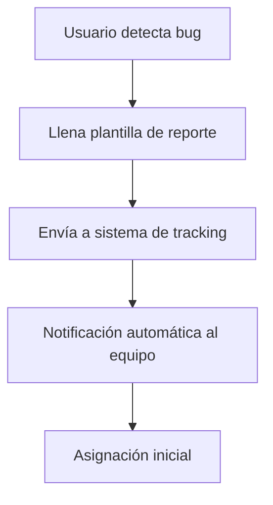
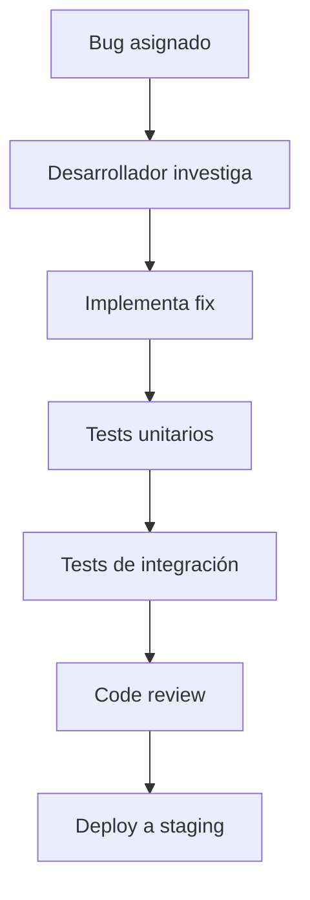
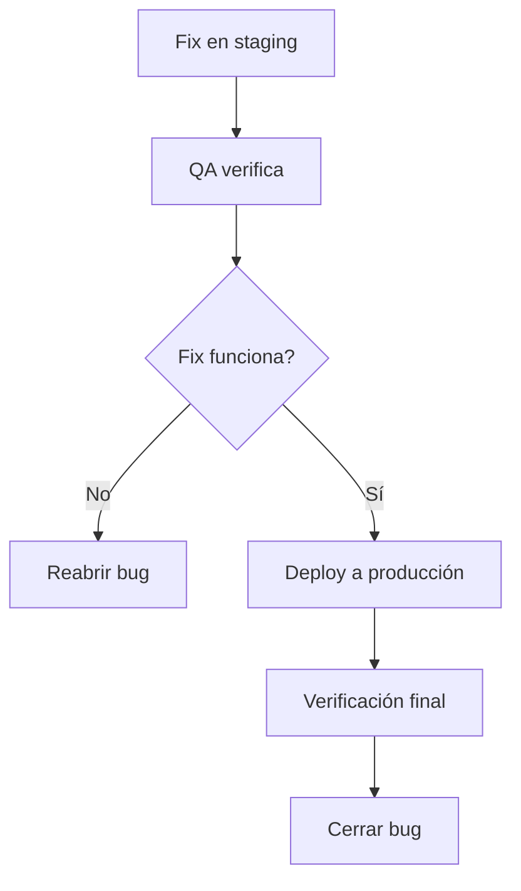

# Sistema de Tracking de Bugs

**Versión:** 1.0  
**Fecha:** 2025-01-13  
**Autor:** [Tu Nombre]  
**Estado:** Activo

---

## 🐛 Propósito

Este documento define el sistema completo de tracking, reporte y resolución de bugs para mantener la calidad del software y mejorar la experiencia del usuario.

---

## 📋 Clasificación de Bugs

### Por Severidad

| Nivel | Descripción | Tiempo de Respuesta | Ejemplo |
|-------|-------------|-------------------|---------|
| **Crítica** | Bloquea completamente la funcionalidad core | < 2 horas | Login no funciona |
| **Alta** | Funcionalidad importante afectada | < 4 horas | No se pueden crear usuarios |
| **Media** | Funcionalidad secundaria afectada | < 24 horas | Reporte no se genera |
| **Baja** | Mejora o bug cosmético | < 72 horas | Botón mal alineado |

### Por Tipo

| Tipo | Descripción | Responsable |
|------|-------------|-------------|
| **Frontend** | Errores en la interfaz de usuario | Frontend Developer |
| **Backend** | Errores en la API o lógica de negocio | Backend Developer |
| **Database** | Problemas con la base de datos | DevOps Engineer |
| **Performance** | Problemas de rendimiento | Full Stack Developer |
| **Security** | Vulnerabilidades de seguridad | Security Engineer |
| **UX/UI** | Problemas de experiencia de usuario | UX Designer |

---

## 📝 Plantilla de Reporte de Bug

### Información Básica
```
ID: BUG-YYYY-XXXX
Título: [Descripción concisa del problema]
Reportado por: [Nombre del reportero]
Fecha: [YYYY-MM-DD HH:MM]
Prioridad: [Crítica/Alta/Media/Baja]
Tipo: [Frontend/Backend/Database/Performance/Security/UX/UI]
```

### Descripción Detallada
```
Descripción:
[Descripción detallada del problema]

Pasos para reproducir:
1. [Paso 1]
2. [Paso 2]
3. [Paso 3]

Comportamiento esperado:
[Qué debería pasar]

Comportamiento actual:
[Qué está pasando]

Información adicional:
- Navegador: [Chrome/Firefox/Safari/Edge]
- Versión: [X.X.X]
- Sistema operativo: [Windows/Mac/Linux]
- Dispositivo: [Desktop/Mobile/Tablet]
```

### Evidencia
```
Screenshots/Videos:
[Enlaces a capturas de pantalla o videos]

Logs:
[Logs de error si están disponibles]

Console errors:
[Errores de la consola del navegador]
```

---

## 🔄 Flujo de Trabajo

### 1. Detección y Reporte


### 2. Triage y Asignación
```mermaid
graph TD
    A[Bug reportado] --> B[Review inicial]
    B --> C{Es reproducible?}
    C -->|No| D[Cerrar como "No reproducible"]
    C -->|Sí| E[Asignar severidad]
    E --> F[Asignar a desarrollador]
    F --> G[Establecer timeline]
```

### 3. Desarrollo y Testing


### 4. Verificación y Cierre


---

## 🛠️ Herramientas de Tracking

### Sistema Principal: GitHub Issues
```yaml
# .github/ISSUE_TEMPLATE/bug_report.yml
name: Bug Report
description: Report a bug to help us improve
title: "[BUG] "
labels: ["bug"]
assignees: ["@team-lead"]

body:
  - type: markdown
    attributes:
      value: |
        Thanks for taking the time to fill out this bug report!

  - type: input
    id: title
    attributes:
      label: Bug Title
      description: A clear and concise title
      placeholder: "Login button not working"
    validations:
      required: true

  - type: textarea
    id: description
    attributes:
      label: Bug Description
      description: A clear and concise description of the bug
      placeholder: "When I click the login button, nothing happens..."
    validations:
      required: true

  - type: dropdown
    id: severity
    attributes:
      label: Severity
      options:
        - Critical
        - High
        - Medium
        - Low
    validations:
      required: true

  - type: dropdown
    id: type
    attributes:
      label: Bug Type
      options:
        - Frontend
        - Backend
        - Database
        - Performance
        - Security
        - UX/UI
    validations:
      required: true

  - type: textarea
    id: steps
    attributes:
      label: Steps to Reproduce
      description: Steps to reproduce the behavior
      placeholder: |
        1. Go to '...'
        2. Click on '....'
        3. Scroll down to '....'
        4. See error
    validations:
      required: true

  - type: textarea
    id: expected
    attributes:
      label: Expected Behavior
      description: What you expected to happen
      placeholder: "The login should redirect to dashboard"
    validations:
      required: true

  - type: textarea
    id: actual
    attributes:
      label: Actual Behavior
      description: What actually happened
      placeholder: "Nothing happens when clicking login"
    validations:
      required: true

  - type: input
    id: browser
    attributes:
      label: Browser
      placeholder: "Chrome 120.0.6099.109"
    validations:
      required: true

  - type: input
    id: os
    attributes:
      label: Operating System
      placeholder: "Windows 11"
    validations:
      required: true

  - type: textarea
    id: logs
    attributes:
      label: Console Logs
      description: Any console errors or logs
      placeholder: "Error: Cannot read property 'login' of undefined"
    validations:
      required: false

  - type: input
    id: screenshots
    attributes:
      label: Screenshots
      description: Add screenshots if applicable
      placeholder: "https://example.com/screenshot.png"
    validations:
      required: false
```

### Labels y Milestones
```yaml
# Labels recomendadas
labels:
  - name: "bug"
    color: "d73a4a"
    description: "Something isn't working"
  
  - name: "critical"
    color: "b60205"
    description: "Critical bug requiring immediate attention"
  
  - name: "high-priority"
    color: "ff7f50"
    description: "High priority bug"
  
  - name: "frontend"
    color: "0366d6"
    description: "Frontend related issue"
  
  - name: "backend"
    color: "28a745"
    description: "Backend related issue"
  
  - name: "security"
    color: "ff0000"
    description: "Security vulnerability"
  
  - name: "performance"
    color: "ffa500"
    description: "Performance issue"
  
  - name: "duplicate"
    color: "cfd3d7"
    description: "Duplicate issue"
  
  - name: "wontfix"
    color: "ffffff"
    description: "Will not be fixed"
  
  - name: "invalid"
    color: "e4e669"
    description: "Invalid issue"
```

---

## 📊 Métricas y Reportes

### KPIs de Calidad
```typescript
// metrics/bug-tracking.ts
interface BugMetrics {
  totalBugs: number;
  openBugs: number;
  closedBugs: number;
  criticalBugs: number;
  averageResolutionTime: number;
  bugsBySeverity: Record<string, number>;
  bugsByType: Record<string, number>;
  bugsByDeveloper: Record<string, number>;
}

class BugTracker {
  async getMetrics(): Promise<BugMetrics> {
    // Implementación para obtener métricas
    return {
      totalBugs: 0,
      openBugs: 0,
      closedBugs: 0,
      criticalBugs: 0,
      averageResolutionTime: 0,
      bugsBySeverity: {},
      bugsByType: {},
      bugsByDeveloper: {}
    };
  }

  async generateReport(): Promise<string> {
    const metrics = await this.getMetrics();
    
    return `
# Bug Tracking Report - ${new Date().toLocaleDateString()}

## Resumen
- Total de bugs: ${metrics.totalBugs}
- Bugs abiertos: ${metrics.openBugs}
- Bugs cerrados: ${metrics.closedBugs}
- Bugs críticos: ${metrics.criticalBugs}

## Tiempo promedio de resolución
${metrics.averageResolutionTime} horas

## Distribución por severidad
${Object.entries(metrics.bugsBySeverity)
  .map(([severity, count]) => `- ${severity}: ${count}`)
  .join('\n')}

## Distribución por tipo
${Object.entries(metrics.bugsByType)
  .map(([type, count]) => `- ${type}: ${count}`)
  .join('\n')}
    `;
  }
}
```

### Dashboard de Bugs
```typescript
// components/BugDashboard.tsx
import React, { useState, useEffect } from 'react';
import { BugMetrics } from '../types/bug';

interface BugDashboardProps {
  metrics: BugMetrics;
}

export const BugDashboard: React.FC<BugDashboardProps> = ({ metrics }) => {
  return (
    <div className="grid grid-cols-1 md:grid-cols-2 lg:grid-cols-4 gap-4">
      <div className="bg-white p-6 rounded-lg shadow">
        <h3 className="text-lg font-semibold text-gray-900">Total Bugs</h3>
        <p className="text-3xl font-bold text-blue-600">{metrics.totalBugs}</p>
      </div>
      
      <div className="bg-white p-6 rounded-lg shadow">
        <h3 className="text-lg font-semibold text-gray-900">Open Bugs</h3>
        <p className="text-3xl font-bold text-red-600">{metrics.openBugs}</p>
      </div>
      
      <div className="bg-white p-6 rounded-lg shadow">
        <h3 className="text-lg font-semibold text-gray-900">Critical Bugs</h3>
        <p className="text-3xl font-bold text-orange-600">{metrics.criticalBugs}</p>
      </div>
      
      <div className="bg-white p-6 rounded-lg shadow">
        <h3 className="text-lg font-semibold text-gray-900">Avg Resolution</h3>
        <p className="text-3xl font-bold text-green-600">
          {metrics.averageResolutionTime}h
        </p>
      </div>
    </div>
  );
};
```

---

## 🔔 Notificaciones y Alertas

### Configuración de Alertas
```yaml
# .github/workflows/bug-alerts.yml
name: Bug Alerts

on:
  issues:
    types: [opened, labeled, assigned]

jobs:
  notify-team:
    runs-on: ubuntu-latest
    steps:
      - name: Check if critical bug
        id: check-severity
        run: |
          if [[ "${{ github.event.issue.labels.*.name }}" == *"critical"* ]]; then
            echo "is_critical=true" >> $GITHUB_OUTPUT
          else
            echo "is_critical=false" >> $GITHUB_OUTPUT
          fi

      - name: Send Slack notification
        if: steps.check-severity.outputs.is_critical == 'true'
        uses: 8398a7/action-slack@v3
        with:
          status: custom
          custom_payload: |
            {
              "text": "🚨 Critical bug reported!",
              "attachments": [{
                "title": "${{ github.event.issue.title }}",
                "title_link": "${{ github.event.issue.html_url }}",
                "text": "${{ github.event.issue.body }}",
                "color": "danger"
              }]
            }
        env:
          SLACK_WEBHOOK_URL: ${{ secrets.SLACK_WEBHOOK_URL }}

      - name: Send email notification
        if: steps.check-severity.outputs.is_critical == 'true'
        run: |
          echo "Critical bug: ${{ github.event.issue.title }}" | \
          mail -s "Critical Bug Alert" team@company.com
```

### Escalación Automática
```typescript
// utils/bug-escalation.ts
interface BugEscalation {
  bugId: string;
  severity: 'critical' | 'high' | 'medium' | 'low';
  assignedTo: string;
  createdAt: Date;
  escalatedAt?: Date;
  escalatedTo?: string;
}

class BugEscalationService {
  private escalationRules = {
    critical: { hours: 2, escalateTo: 'tech-lead' },
    high: { hours: 4, escalateTo: 'senior-dev' },
    medium: { hours: 24, escalateTo: 'team-lead' },
    low: { hours: 72, escalateTo: 'project-manager' }
  };

  async checkForEscalation(bug: BugEscalation): Promise<void> {
    const rule = this.escalationRules[bug.severity];
    const hoursSinceCreation = (Date.now() - bug.createdAt.getTime()) / (1000 * 60 * 60);

    if (hoursSinceCreation > rule.hours && !bug.escalatedAt) {
      await this.escalateBug(bug, rule.escalateTo);
    }
  }

  private async escalateBug(bug: BugEscalation, escalateTo: string): Promise<void> {
    // Implementar lógica de escalación
    console.log(`Escalating bug ${bug.bugId} to ${escalateTo}`);
    
    // Enviar notificación
    await this.sendEscalationNotification(bug, escalateTo);
    
    // Actualizar bug
    await this.updateBugEscalation(bug.bugId, escalateTo);
  }

  private async sendEscalationNotification(bug: BugEscalation, escalateTo: string): Promise<void> {
    // Implementar envío de notificación
  }

  private async updateBugEscalation(bugId: string, escalateTo: string): Promise<void> {
    // Implementar actualización en base de datos
  }
}
```

---

## 📈 Mejora Continua

### Análisis de Tendencias
```typescript
// analytics/bug-trends.ts
interface BugTrend {
  period: string;
  totalBugs: number;
  criticalBugs: number;
  averageResolutionTime: number;
  bugsByType: Record<string, number>;
}

class BugTrendAnalyzer {
  async analyzeTrends(months: number = 6): Promise<BugTrend[]> {
    // Implementar análisis de tendencias
    return [];
  }

  async identifyHotspots(): Promise<string[]> {
    // Identificar áreas con más bugs
    return [];
  }

  async generateRecommendations(): Promise<string[]> {
    // Generar recomendaciones de mejora
    return [
      "Considerar refactoring del módulo de autenticación",
      "Implementar más tests automatizados",
      "Mejorar documentación de API",
      "Revisar proceso de code review"
    ];
  }
}
```

### Retrospectivas de Bugs
```markdown
# Retrospectiva de Bugs - Sprint X

## Bugs Reportados
- Total: 15
- Críticos: 2
- Altos: 5
- Medios: 6
- Bajos: 2

## Análisis de Causas Raíz
1. **Falta de testing**: 40% de los bugs
2. **Documentación desactualizada**: 25% de los bugs
3. **Comunicación entre equipos**: 20% de los bugs
4. **Complejidad del código**: 15% de los bugs

## Acciones de Mejora
- [ ] Implementar testing automatizado más robusto
- [ ] Actualizar documentación semanalmente
- [ ] Mejorar comunicación en code reviews
- [ ] Refactorizar módulos complejos

## Métricas de Seguimiento
- Tiempo promedio de resolución: 8 horas
- Tasa de reincidencia: 5%
- Satisfacción del usuario: 4.2/5
```

---

## ✅ Checklist de Implementación

### Configuración Inicial
- [ ] Sistema de tracking configurado (GitHub Issues)
- [ ] Plantillas de reporte creadas
- [ ] Labels y milestones definidos
- [ ] Workflow de notificaciones configurado
- [ ] Dashboard de métricas implementado

### Proceso de Trabajo
- [ ] Flujo de trabajo documentado
- [ ] Roles y responsabilidades definidos
- [ ] Escalación automática configurada
- [ ] Reportes automáticos programados
- [ ] Retrospectivas programadas

### Monitoreo y Mejora
- [ ] KPIs definidos y medidos
- [ ] Análisis de tendencias implementado
- [ ] Sistema de recomendaciones activo
- [ ] Proceso de mejora continua establecido
- [ ] Documentación actualizada regularmente

---

## 📚 Recursos Adicionales

### Documentación
- [GitHub Issues Documentation](https://docs.github.com/en/issues)
- [Bug Tracking Best Practices](https://example.com/best-practices)
- [Quality Assurance Guidelines](https://example.com/qa-guidelines)

### Herramientas Recomendadas
- **Issue Tracking**: GitHub Issues, Jira, Linear
- **Error Monitoring**: Sentry, Bugsnag, Rollbar
- **Testing**: Jest, Playwright, Cypress
- **Monitoring**: DataDog, New Relic, Grafana

### Plantillas
- [Bug Report Template](./templates/bug-report.md)
- [Bug Resolution Template](./templates/bug-resolution.md)
- [Retrospective Template](./templates/retrospective.md) 